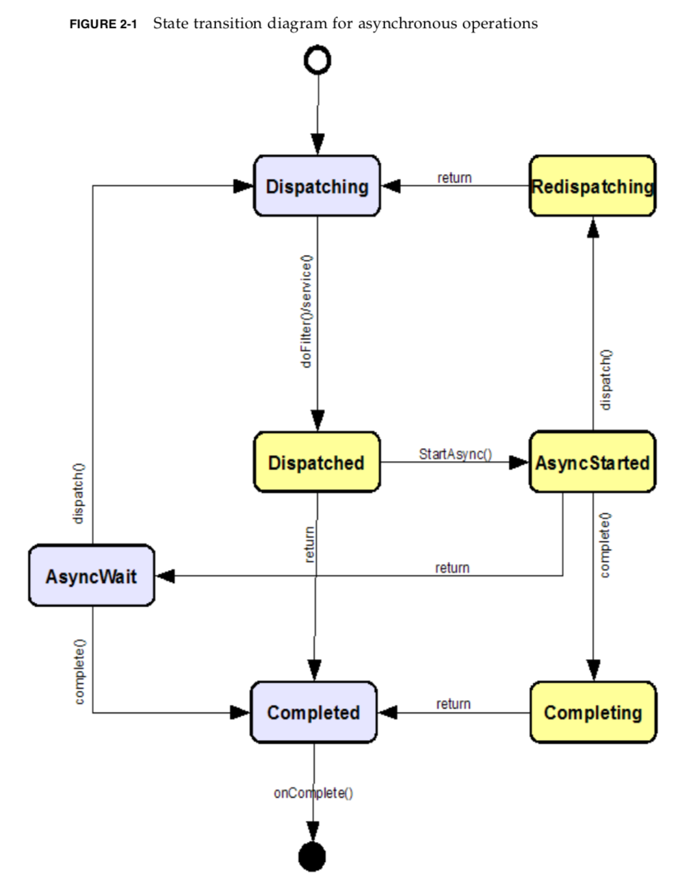

# Servlet

본 문서는 Servlet 4.0 spec을 기준으로 읽으면서 정리한 내용입니다.
잘못된 내용은 편하게 수정 요청 주시면 됩니다.

## Servlet이란?

Java base의 web component를 제공합니다.
Spring MVC의 경우 해당 Servlet으로 구현이 되어 있습니다.

## Survlet Container이란?

1. Web server 또는 application server에서 request, response를 처리하는 역할을 담당합니다.
2. Servlet container 자체에서는 자체 life cycle에서 servlet들을 관리하는 역할까지 포함합니다.

## Scenario

1. Client는 HTTP request 형태를 통해 web server에 요청을 보냅니다.
2. Web server는 servlet container로 해당 request를 위임합니다.
3. Servlet container는 response, request object을 생성해서 적합한 servlet에게 invoke 시킵니다.
4. Client의 요청을 parsing하여, 적합한 response object를 생성합니다.
5. Servlet이 processing이 끝나면 servlet container는 reponse가 flush 됐는지 확인하고, web server에게 제어권을 넘깁니다.

## Servlet Diagram

## 출처

[survlet 4.0 specification](https://javaee.github.io/servlet-spec/downloads/servlet-4.0/servlet-4_0_FINAL.pdf)
[spring docs](https://docs.spring.io/spring/docs/5.2.x/spring-framework-reference/html/mvc.html)